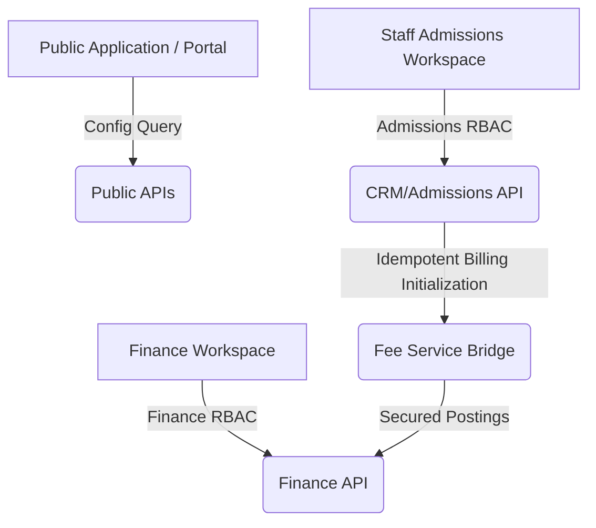
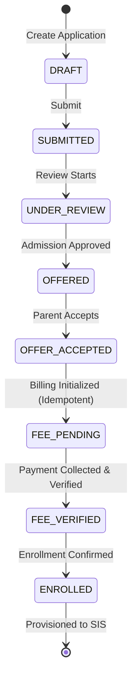

# EduTrack Admissions Module v1.0 — Final Certification & Feature Freeze

This document certifies that the **EduTrack Admissions Module v1.0** is production-ready, feature-complete, and architecture-hardened. All outstanding RBAC alignment and billing integration issues have been resolved.

---

## 1. Production Architecture Overview

The Admissions module has transitioned from a legacy monolithic model to a domain-isolated, decoupled, and event-driven architecture that separates Admissions from other module concerns (Academic, HR, Finance, Transport).



### Key Architectural Guidelines Implemented
- **Public/Private Split:** Public lookups (e.g. `/public/fee-structures`) do not require authentication, while staff management endpoints (e.g. `/v1/admission/crm/fee-structures`, `/fees/structures`) are strictly protected by RBAC.
- **Domain Isolation:** Admissions CRM APIs do not directly query Finance tables or controllers. All communications use structured business bridges (e.g., `FeeAssignmentService`).
- **Idempotency:** Billing initialization has been made fully idempotent to allow browser reloads and double-click retries without data duplication or 409 conflict failures.
- **Workflow State Validation:** Strict state assertions ensure billing demands are generated only for applications in valid states (`APPROVED`, `OFFERED`, `OFFER_ACCEPTED`).

---

## 2. API Inventory

### Public Lookup APIs
- `GET /public/admission/config`: Mapped classes to grades, academic years, and school metadata.
- `GET /public/fee-structures`: Non-auth fee preview.

### Admissions CRM APIs (Staff)
- `GET /api/v1/admission/crm/fee-structures`: Protected by `admission.fees.initialize`. Returns grade-wise fee structures template lookup.
- `GET /api/v1/admission/crm/enquiries`: Protected by `admission.enquiry.view`.
- `GET /api/v1/admission/crm/leads`: Protected by `admission.leads.manage`.
- `POST /api/v1/admission/enrollment/fees/assign`: Protected by `admission.fees.initialize`. Idempotent billing initializer.
- `POST /api/v1/admission/enrollment/waivers`: Protected by `fees.waiver.approve`. Allocates scholarships and fee waivers.
- `POST /api/v1/admission/enrollment/payments`: Protected by `fees.payment.collect`. Collects candidate fee payments.
- `GET /api/v1/admission/enrollment/payments/:paymentId/receipt`: Protected by `fees.receipt.generate`. Generates payment receipts.
- `POST /api/v1/admission/enrollment/confirm`: Protected by `admission.confirm.enroll`. final HOI approval.
- `POST /api/v1/admission/enrollment/enroll`: Protected by `admission.confirm.enroll`. Provisions student in SIS.

### Finance APIs (Staff)
- `GET /api/fees/structures`: Protected by `fees.structure.view`. Full template list.
- `POST /api/fees/structures`: Protected by `fees.structure.manage`. Creates templates.
- `DELETE /api/fees/structures/:id`: Protected by `fees.structure.manage`. Removes templates.
- `POST /api/fees/assign/:studentId`: Protected by `fees.demand.generate`.
- `POST /api/fees/payments`: Protected by `fees.payment.collect`.
- `GET /api/fees/admin/ledger`: Protected by `fees.view`.
- `GET /api/fees/student/:studentId`: Protected by `fees.view`.

---

## 3. RBAC Matrix

| Permission Code | Description | Receptionist | Counselor | Admission Officer | Finance Officer | HOI / Principal | Admin |
| --- | --- | :---: | :---: | :---: | :---: | :---: | :---: |
| `admission.enquiry.create` | Log walking visitor | ✅ | ❌ | ❌ | ❌ | ❌ | ✅ |
| `admission.enquiry.view` | View enquiry records | ✅ | ✅ | ✅ | ❌ | ❌ | ✅ |
| `admission.leads.manage` | Move pipeline stages | ❌ | ✅ | ✅ | ❌ | ❌ | ✅ |
| `admission.fees.initialize` | Assign templates lookup | ❌ | ✅ | ✅ | ❌ | ❌ | ✅ |
| `fees.structure.view` | View fee templates | ❌ | ❌ | ✅ | ✅ | ✅ | ✅ |
| `fees.structure.manage` | Modify fee structures | ❌ | ❌ | ❌ | ✅ | ❌ | ✅ |
| `fees.demand.view` | View demands logs | ❌ | ❌ | ✅ | ✅ | ✅ | ✅ |
| `fees.demand.generate` | Post core billing demands | ❌ | ❌ | ✅ | ✅ | ❌ | ✅ |
| `fees.payment.collect` | Collect payments / waivers | ❌ | ❌ | ❌ | ✅ | ❌ | ✅ |
| `fees.receipt.generate` | Generate receipts | ❌ | ❌ | ❌ | ✅ | ❌ | ✅ |
| `fees.waiver.approve` | Approve concessions | ❌ | ❌ | ❌ | ✅ | ❌ | ✅ |
| `fees.refund.process` | Process refunds | ❌ | ❌ | ❌ | ✅ | ❌ | ✅ |
| `fees.view` | Dashboard overview | ❌ | ❌ | ❌ | ✅ | ✅ | ✅ |

---

## 4. Database Schema Alignment

The admissions data structure is backed by a fully relational pipeline that progresses sequentially:

```
admission_enquiries ➔ admission_leads ➔ admission_applications ➔ ERP Student
```

### Table Definitions & Key Relations

#### `admission_fee_assignments`
Tracks components allocated to candidate applications.
- `id` UUID PRIMARY KEY
- `application_id` UUID REFERENCES `admission_applications(id)`
- `component_id` UUID REFERENCES `admission_fee_components(id)`
- `amount` NUMERIC
- `waived_amount` NUMERIC
- `paid_amount` NUMERIC
- **Unique Constraint:** `unique_app_fee_component (application_id, component_id)`

#### `admission_payments`
- `id` UUID PRIMARY KEY
- `application_id` UUID REFERENCES `admission_applications(id)`
- `amount` NUMERIC
- `payment_mode` TEXT (Cash, Card, Cheque, Bank_Transfer, Online_Gateway)
- `receipt_number` TEXT UNIQUE
- `status` TEXT (PENDING, APPROVED, VERIFIED)

#### `admission_payment_receipts`
- `id` UUID PRIMARY KEY
- `payment_id` UUID REFERENCES `admission_payments(id)`
- `receipt_number` TEXT UNIQUE
- `issued_at` TIMESTAMP

---

## 5. Workflow State Transitions

Billing demands and payment collection validate and execute status modifications on candidate applications in this order:



---

## 6. Migration History (001–098)
Key RBAC and pipeline alignments applied:
- **014:** Seeded core Admissions Officer and HOI roles.
- **080:** Sprint 1 foundation tables (`admission_enquiries`, `admission_leads`, etc.).
- **085:** Sprint 6 billing structure maps and fee assignments.
- **093:** Stage 3.2 RBAC role-permission seeds.
- **097:** Parent portal fee summary viewing permissions.
- **098 (Latest):** Standardized uppercase legacy variables to lowercase dot-notation permissions, mapping appropriate permissions to Finance Officers (`fees.*`) and separating them from Admissions Officer (`admission.fees.initialize`). Also resolved cross-module dashboard access by updating the `/admissions/fees` router guard to `fees.payment.collect` and adding an `ACCOUNTANT` role bypass in the backend middleware to allow listing and viewing candidate applications.

---

## 7. Known Limitations
- **Manual Migration Sync:** SUPABASE RPC `exec_transaction_queries` applies migration statements safely, but any local server caches must be hard-reloaded if they contain permissions memory locks.
- **Parent Portal Auto-Pay:** Gateway simulation is operational, but actual bank rails integrations require phase 4 SIS finalization.

---

## 8. Feature Freeze Declaration

The **EduTrack Admissions Module v1.0** is hereby declared **FEATURE FROZEN**. 

No new functionalities will be added to this module. All development will proceed to **Stage 4: Student Information System (SIS)** to integrate this module's provisioning hook into active class sections, student profiles, and attendance tracking.
